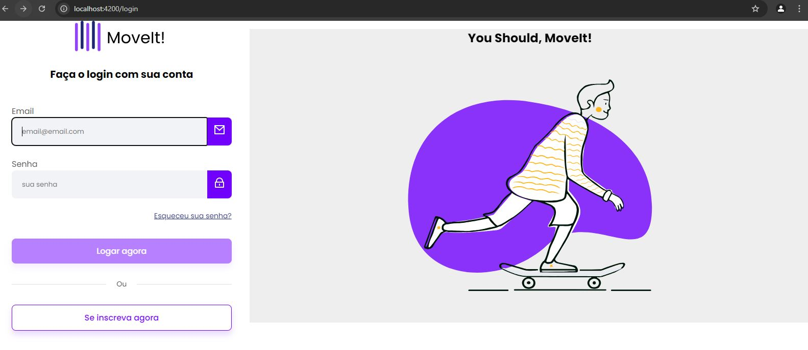
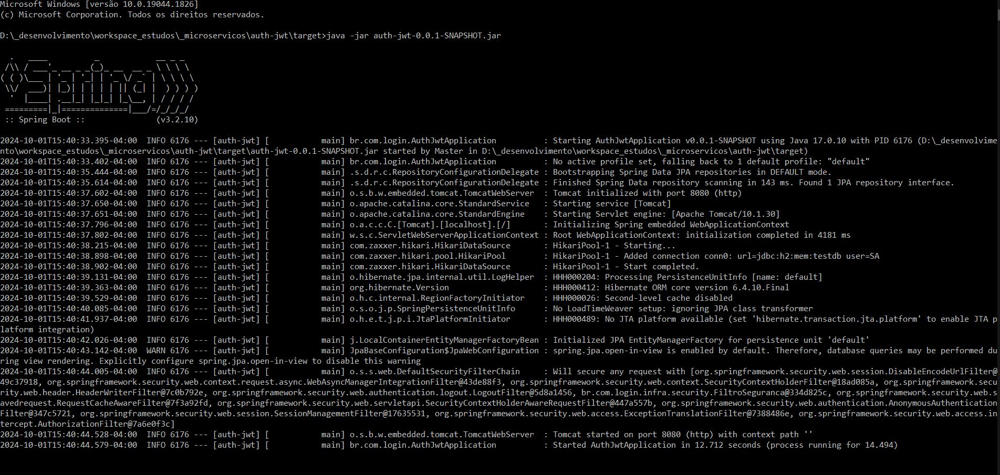

## Aplicação Angular v15 de Login

Desenvolvido aplicação de login baseado em token JWT integrado a API Spring Boot.

# Frontend

Projeto criado com [Angular CLI](https://github.com/angular/angular-cli) versão 15.2.11.
 
- HTML 5
- CSS 3
- Angular 15
- Typescript
- Toastr

  

Projeto front-end baseado no link: https://www.figma.com/design/7T1wkErczpMOBeqtpVjMSb/Login-Page-Design?node-id=6-920&node-type=canvas

 

Tela de Login:

 

# Back-end

APP Spring Boot gerenciando tokens JWT em memória
  
Iniciando o back-end:   
Via terminal, navegar para pasta: _backend na raiz do projeto e executar o comando: java -jar auth-jwt-0.0.1-SNAPSHOT.jar  
A API estará disponivel em: http://localhost:8080/auth/registrar  via método POST.
 
- Java 17
- Spring Boot
- Spring Data
- Spring Security
- Lombok
- JWT 
- h2 database

 
JSON POST
{
    "nome": "user",
    "email": "user@email.com",
    "senha": "password"
}

 

Aplicação JWT Spring:

# Ambiente de execução App Angular
- Node.js instalado
- Instalar Angular CLI
    npm i -g @angular/cli
- Editor básico de edições ex: VS Code
- No diretorio _backend executar o comando: java -jar auth-jwt-0.0.1-SNAPSHOT.jar via terminal
- No diretorio raiz do projeto angular, executar o comando: ng serve

